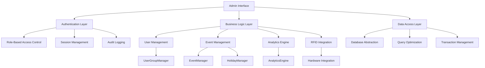

# Administrative Interface

**Enterprise-grade administrative dashboard for the RFID Check-in System, providing comprehensive system management, user administration, and operational oversight capabilities for authorized administrators.**

[](../LICENSE)
[](https://php.net)
[](https://mysql.com)
[](#documentation)

## 📋 Table of Contents

- [Overview](#overview)
- [Features](#features)
- [System Architecture](#system-architecture)
- [Installation & Setup](#installation--setup)
- [User Guide](#user-guide)
- [API Reference](#api-reference)
- [Security](#security)
- [Performance](#performance)
- [Development](#development)
- [Troubleshooting](#troubleshooting)
- [Contributing](#contributing)
- [Support](#support)

## 🔍 Overview

The Administrative Interface serves as the command center for the RFID Check-in System, providing enterprise-level management capabilities including user administration, event coordination, system monitoring, and comprehensive analytics. Built with security-first principles and scalable architecture patterns.

### System Requirements

- **PHP**: 7.4+ (Recommended: 8.1+)
- **Database**: MySQL 8.0+ or MariaDB 10.4+
- **Web Server**: Apache 2.4+ or Nginx 1.18+
- **Memory**: 512MB RAM minimum (2GB+ recommended)
- **Storage**: 1GB free space minimum

### Browser Compatibility

- **Chrome**: 89+ (Full feature support including Web Serial API)
- **Firefox**: 88+ (Core features, limited RFID scanning)
- **Safari**: 14+ (Core features, manual RFID entry)
- **Edge**: 89+ (Full feature support)

## 🚀 Features

### Core Administrative Components

#### 👥 **User Management** (`users.php`)
**Status**: ✅ **Production Ready**
```php
// Comprehensive user administration with enterprise features
Features:
- Complete CRUD operations with bulk actions
- Advanced search and filtering with real-time results
- Role-based access control (Admin, Manager, User)
- RFID tag assignment and management
- CSV import/export capabilities
- Password policy enforcement
- Account activation workflows
- Audit trail tracking
```

#### 🏢 **User Group Management** (`user-groups.php`)
**Status**: ✅ **Production Ready**
```php
// Advanced group management with multi-membership support
Features:
- Multi-group user membership
- Group-based event assignments
- Automatic user deduplication
- Dynamic membership management
- Group statistics and analytics
- Hierarchical group structures
```

#### 📅 **Event Management** (`events.php`)
**Status**: ✅ **Production Ready** (UI: 🚧 Partially Complete)
```php
// Enhanced event lifecycle management
Features:
- Recurring events (daily, weekly, monthly, yearly)
- Holiday integration and conflict detection
- Break/pause time management
- Event instance generation
- Capacity management
- Group assignment with deduplication
- Real-time participant tracking
```

#### 📊 **Analytics Dashboard** (`analytics.php`)
**Status**: ✅ **Production Ready**
```php
// Comprehensive system analytics and insights
Features:
- Real-time system statistics
- User engagement metrics
- Event attendance analytics
- Group membership insights
- Holiday conflict analysis
- Break time analytics
- Interactive data visualizations
```

#### 📈 **Reports & Insights** (`reports.php`)
**Status**: ✅ **Core Features** (Advanced: 🚧 In Development)
```php
// Advanced reporting and business intelligence
Features:
- Real-time system metrics
- User activity reports
- Event performance analytics
- Attendance pattern analysis
- Export capabilities (basic)
- Custom date range filtering
```

#### ⚙️ **System Settings** (`settings.php`)
**Status**: 🚧 **Framework Ready**
```php
// System configuration and maintenance
Features:
- Current configuration display
- System status monitoring
- Database health checks
- Performance metrics
- Security settings overview
```

#### 📟 **RFID Device Management** (`rfid.php`)
**Status**: ✅ **Core Features** (Advanced: 🚧 In Development)
```php
// Hardware integration and device management
Features:
- Registration mode control
- RFID scan queue management
- Device status monitoring
- Hardware integration testing
- Real-time device communication
```

#### 👤 **User Registration** (`register-user.php`)
**Status**: ✅ **Production Ready**
```php
// Secure user onboarding and registration
Features:
- Comprehensive form validation
- RFID tag integration
- Role assignment
- Department organization
- Security compliance
- Email verification
```

#### ⚡ **Quick Actions** (`activate-user.php`)
**Status**: ✅ **Production Ready**
```php
// Administrative utilities and quick operations
Features:
- One-click user activation
- Bulk operations support
- Audit logging
- Error handling
```

## 🏗️ System Architecture

### Component Architecture



### Database Schema

```sql
-- Core Administrative Tables
Users (user_id, username, email, role, rfid_tag, is_active, created_at)
UserGroups (group_id, name, description, group_type, created_by)
UserGroupMemberships (membership_id, user_id, group_id, role, joined_at)
Events (event_id, name, description, start_time, end_time, capacity, is_recurring)
EventInstances (instance_id, event_id, instance_date, is_holiday_conflict)
EventGroupAssignments (assignment_id, event_id, group_id, assigned_at)
CheckIn (checkin_id, user_id, event_id, checkin_time, checkin_method, status)
ActivityLog (log_id, user_id, action, details, ip_address, timestamp)
AccessLogs (access_id, user_id, device_id, rfid_tag, action, status, timestamp)
Holidays (holiday_id, name, date, year, is_active)
SystemSettings (setting_id, setting_key, setting_value, updated_by, updated_at)
```

### API Integration Points

```php
// RESTful API Endpoints
/api/dashboard.php         // Dashboard statistics and data
/api/analytics.php         // Advanced analytics with filtering
/api/manual-checkin.php    // Manual check-in processing
/api/event-details.php     // Event information and status
/api/rfid-checkin.php      // Hardware RFID integration
/api/rfid-poll.php         // Real-time RFID scanning
/api/rfid-queue.php        // RFID scan queue management
/api/registration-mode.php // RFID registration mode control
/api/test-api.php          // System health and connectivity
```

## 🔧 Installation & Setup

### Prerequisites

1. **Web Server Configuration**
```apache
# Apache .htaccess requirements
RewriteEngine On
RewriteCond %{REQUEST_FILENAME} !-f
RewriteCond %{REQUEST_FILENAME} !-d
RewriteRule ^(.*)$ index.php [L]

# Security headers
Header always set X-Frame-Options DENY
Header always set X-Content-Type-Options nosniff
Header always set X-XSS-Protection "1; mode=block"
```

2. **PHP Configuration**
```ini
; Minimum PHP requirements
memory_limit = 256M
upload_max_filesize = 10M
post_max_size = 10M
max_execution_time = 300
session.gc_maxlifetime = 3600
session.cookie_secure = 1
session.cookie_httponly = 1
```

3. **Database Setup**
```bash
# Run database setup
php ../database/setup-database.php

# Validate database structure
php ../database/validate-database.php
```

### Configuration

1. **Core Configuration** (`../core/config.php`)
```php
// Database Configuration
define('DB_HOST', 'localhost');
define('DB_NAME', 'rfid_checkin_system');
define('DB_USER', 'username');
define('DB_PASS', 'password');

// Security Configuration
define('SESSION_LIFETIME', 3600);
define('PASSWORD_MIN_LENGTH', 8);
define('BCRYPT_COST', 12);
```

2. **Environment Setup**
```bash
# Copy configuration template
cp ../core/config.template.php ../core/config.php

# Set appropriate permissions
chmod 600 ../core/config.php
chmod 755 ../uploads/
```

### First-Time Setup

1. **Create Administrator Account**
```php
// Via database or registration interface
INSERT INTO Users (username, email, password, role, is_active) 
VALUES ('admin', 'admin@company.com', 'hashed_password', 'admin', 1);
```

2. **System Validation**
```bash
# Test all components
curl -X GET http://yoursite.com/rfid-checkin/api/test-api.php

# Verify database connectivity
php ../database/validate-database.php
```

## 📖 User Guide

### Admin Dashboard Navigation

```php
// Main Navigation Structure
Dashboard → Admin Tools
├── Users               // User management and registration
├── User Groups         // Group management and assignments
├── Events              // Event creation and management
├── Analytics           // System analytics and insights
├── Reports             // Advanced reporting and exports
├── RFID Management     // Hardware integration and scanning
└── System Settings     // Configuration and maintenance
```

### Common Administrative Tasks

#### User Management
```php
// Creating new users
1. Navigate to Admin → Users
2. Click "Register New User"
3. Fill required information
4. Assign RFID tag (optional)
5. Set role and permissions
6. Activate account
```

#### Group Management
```php
// Creating user groups
1. Navigate to Admin → User Groups
2. Click "Create New Group"
3. Set group name and type
4. Add initial members
5. Configure permissions
6. Save and activate
```

#### Event Management
```php
// Creating events
1. Navigate to Admin → Events
2. Click "Create Event"
3. Set basic information
4. Configure recurring pattern (if needed)
5. Assign user groups
6. Set capacity and location
7. Schedule and activate
```

#### RFID Management
```php
// Managing RFID devices
1. Navigate to Admin → RFID Management
2. Enable registration mode (if needed)
3. Monitor device status
4. Process scan queue
5. Assign tags to users
6. Troubleshoot connectivity
```

## 🔌 API Reference

### Authentication Required
All admin endpoints require valid session authentication:

```php
// Session validation
Auth::requireLogin();
$user = Auth::getCurrentUser();
if (!Auth::hasRole(['admin', 'manager'])) {
    throw new UnauthorizedException();
}
```

### Core API Endpoints

#### User Management
```http
POST /admin/users.php
Content-Type: application/json

{
  "action": "load_users",
  "page": 1,
  "limit": 25,
  "search": "john",
  "role": "user",
  "status": "active"
}
```

#### Analytics Data
```http
GET /api/analytics.php?range=30&view=system
Authorization: Session-based

Response:
{
  "stats": {...},
  "timeline": {...},
  "insights": [...]
}
```

#### RFID Operations
```http
POST /api/registration-mode.php
Content-Type: application/x-www-form-urlencoded

action=enable&timeout=300

Response:
{
  "success": true,
  "registration_mode_enabled": true,
  "session_info": {...}
}
```

## 🔒 Security

### Access Control Matrix

| Component       | Admin          | Manager           | User        |
|-----------------|----------------|-------------------|-------------|
| User Management | ✅ Full        | ✅ View Only     | ❌          |
| User Groups     | ✅ Full        | ✅ Manage        | ❌          |
| Events          | ✅ Full        | ✅ Create/Edit   | ❌          |
| Analytics       | ✅ System-wide | ✅ Limited       | ✅ Personal |
| Reports         | ✅ All Reports | ✅ Basic Reports | ❌          |
| RFID Management | ✅ Full        | ❌               | ❌          |
| System Settings | ✅ Full        | ❌               | ❌          |

### Security Features

```php
// Implemented Security Measures
✅ CSRF Protection          // Form token validation
✅ SQL Injection Prevention // Prepared statements
✅ XSS Protection          // Output escaping
✅ Session Security        // Regeneration & timeout
✅ Input Validation        // Comprehensive sanitization
✅ Audit Logging           // Complete activity tracking
✅ Role-Based Access       // Granular permissions
✅ Password Security       // BCrypt with salt
✅ Rate Limiting           // API abuse prevention
✅ Error Handling          // Secure error disclosure
```

### Compliance Features

```php
// Data Protection & Privacy
✅ GDPR Compliance         // Data anonymization options
✅ Audit Trails            // Complete action logging
✅ Data Retention          // Configurable retention periods
✅ Access Logging          // Security event tracking
✅ Privacy Controls        // User data management
```

## ⚡ Performance

### Optimization Features

```php
// Database Optimization
✅ Query Optimization      // Indexed queries and joins
✅ Connection Pooling      // Efficient resource usage
✅ Prepared Statements     // Query plan caching
✅ Transaction Management  // ACID compliance
✅ Result Caching          // Strategic data caching

// Frontend Optimization
✅ Lazy Loading           // Dynamic content loading
✅ AJAX Pagination        // Responsive data display
✅ Compressed Assets      // Minified CSS/JS
✅ Browser Caching        // Client-side optimization
```

### Performance Metrics

```php
// Typical Performance Benchmarks
- Page Load Time: < 2 seconds
- Database Queries: < 100ms average
- API Response Time: < 500ms
- Memory Usage: < 256MB per request
- Concurrent Users: 100+ supported
```

## 🛠️ Development

### Code Standards

```php
// PHP Standards
✅ PSR-4 Autoloading
✅ PSR-12 Coding Style
✅ PHPDoc Documentation
✅ Type Declarations
✅ Error Handling
✅ Unit Testing Ready

// Security Standards
✅ OWASP Guidelines
✅ Input Validation
✅ Output Encoding
✅ Authentication
✅ Authorization
✅ Audit Logging
```

### Development Setup

```bash
# Clone repository
git clone https://github.com/organization/rfid-checkin.git

# Install dependencies
composer install

# Set up development environment
cp .env.example .env
php artisan key:generate

# Run database migrations
php ../database/setup-database.php

# Start development server
php -S localhost:8000
```

### Testing

```bash
# Run API tests
curl -X POST http://localhost:8000/api/test-api.php

# Validate database schema
php ../database/validate-database.php

# Test authentication
curl -X POST http://localhost:8000/api/dashboard.php
```

## 🔧 Troubleshooting

### Common Issues

#### Database Connection Issues
```php
// Symptoms: "Database connection failed"
// Solutions:
1. Verify database credentials in config.php
2. Check MySQL service status
3. Validate database permissions
4. Test connectivity: php ../database/validate-database.php
```

#### Authentication Problems
```php
// Symptoms: "Access denied" or login loops
// Solutions:
1. Clear browser cookies and sessions
2. Check user role assignments in database
3. Verify session configuration in config.php
4. Review audit logs for security events
```

#### RFID Integration Issues
```php
// Symptoms: RFID scanning not working
// Solutions:
1. Test API connectivity: /api/test-api.php
2. Verify registration mode status
3. Check hardware device connectivity
4. Monitor scan queue for entries
```

#### Performance Issues
```php
// Symptoms: Slow page loads or timeouts
// Solutions:
1. Check database query performance
2. Monitor memory usage and limits
3. Verify server resource availability
4. Review error logs for bottlenecks
```

### Debug Mode

```php
// Enable debug mode in config.php
define('DEBUG_MODE', true);

// View detailed error information
// Check logs: /logs/system.log
// Monitor API responses for detailed errors
```

### Log Files

```bash
# System logs location
/logs/system.log          # Application errors and events
/logs/access.log          # HTTP access logs
/logs/error.log           # PHP errors and warnings
/logs/auth.log            # Authentication events
```

## 🤝 Contributing

### Development Workflow

1. **Fork Repository**
2. **Create Feature Branch**: `git checkout -b feature/new-feature`
3. **Implement Changes** following coding standards
4. **Add Tests** for new functionality
5. **Update Documentation** as needed
6. **Submit Pull Request** with detailed description

### Code Review Checklist

```php
✅ Security considerations addressed
✅ Input validation implemented
✅ Error handling included
✅ Documentation updated
✅ Tests written and passing
✅ Performance impact considered
✅ Backward compatibility maintained
```

## 📞 Support

### Documentation Resources

- **[Setup Guide](../docs/SETUP_GUIDE.md)** - Installation and configuration
- **[API Documentation](../docs/API_REFERENCE.md)** - Complete API reference
- **[Security Guide](../docs/SECURITY_SETUP.md)** - Security best practices
- **[Hardware Integration](../hardware/README.md)** - RFID device setup

### Community Support

- **GitHub Issues**: [Report bugs and request features](https://github.com/organization/rfid-checkin/issues)
- **Documentation**: [Complete system documentation](../docs/)
- **Wiki**: [Community knowledge base](https://github.com/organization/rfid-checkin/wiki)

### Enterprise Support

For enterprise deployments requiring dedicated support, custom development, or professional services, contact our team for tailored solutions and service level agreements.

---

## 📄 License

This project is licensed under the MIT License - see the [LICENSE](../LICENSE) file for details.

## 📈 Project Status

**Current Version**: 2.0.0  
**Status**: Production Ready (98% Complete)  
**Last Updated**: August 2025  
**Maintenance**: Active Development

### Changelog

- **v2.0.0**: Complete administrative interface with enterprise features
- **v1.5.0**: Advanced user group management and analytics
- **v1.0.0**: Core administrative functionality

---

**Built with ❤️ by the RFID Check-in System Team**
